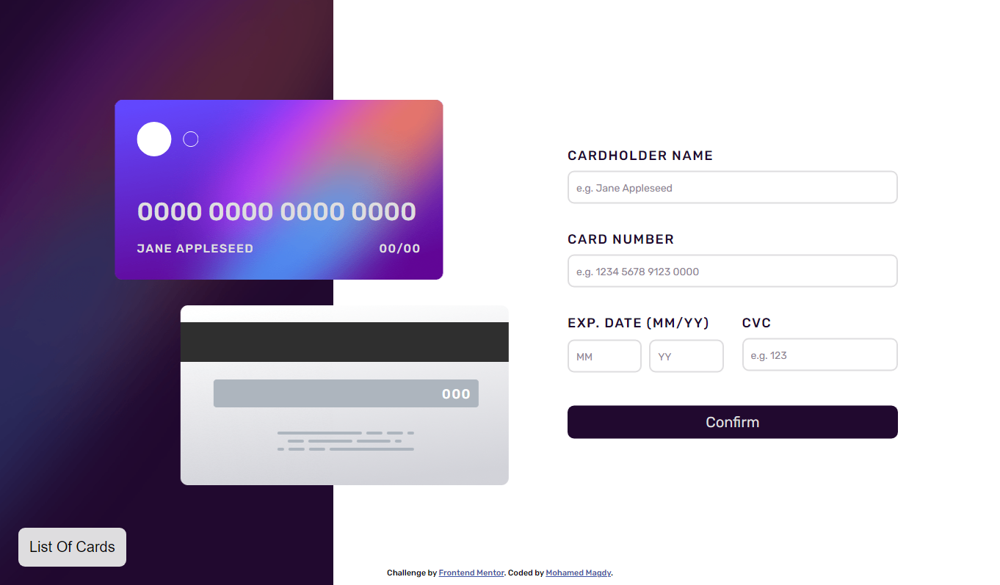

# Frontend Mentor - Interactive card details form solution

This is a solution to the [Interactive card details form challenge on Frontend Mentor](https://www.frontendmentor.io/challenges/interactive-card-details-form-XpS8cKZDWw). Frontend Mentor challenges help you improve your coding skills by building realistic projects. 

## Table of contents

- [Overview](#overview)
  - [The challenge](#the-challenge)
  - [Screenshot](#screenshot)
  - [Links](#links)
- [My process](#my-process)
  - [Built with](#built-with)
- [Author](#author)

## Overview

### The challenge

Users should be able to:

- Fill in the form and see the card details update in real-time
- Receive error messages when the form is submitted if:
  - Any input field is empty
  - The card number, expiry date, or CVC fields are in the wrong format
- View the optimal layout depending on their device's screen size
- See hover, active, and focus states for interactive elements on the page
- Save data in Local Storage
- Delete card
- Delete all cards

### Screenshot

### Links

- Solution URL: [Github](https://github.com/moamed018/Frontend-Mentor-Interactive-card-details-form)
- Frontend Mentor URL: [Frontend Mentor](https://www.frontendmentor.io/solutions/interactive-card-details-form-using-html-css-js-and-localstorage-lQHUIaHctW)
- Live Site URL: [Github Pages](https://moamed018.github.io/Frontend-Mentor-Interactive-card-details-form/)

## My process

### Built with

- Semantic HTML5 markup
- CSS custom properties
- Flexbox
- CSS Grid
- Vanilla Javascript

## Author

- Mohamed Madgy
- Frontend Mentor - [@moamed018](https://www.frontendmentor.io/profile/moamed018)
- Twitter - [@mmagdy_01612](https://twitter.com/mmagdy_01612)

